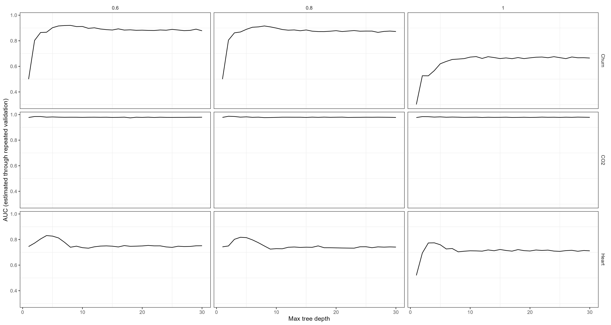

## Elección del experimento

A raiz de que la opción 4 nos llamó la atención decidimos experimentar con switchear al atributo más importante del arbol en distintas proporciones. Para esto modificamos *provided_functions*, específicamente la parte de *prop_switch_y* para crear *prop_switch_x*.

```{r, eval=FALSE}
      var_to_switch <- most_important_attribute
      x_to_switch <- sample(X_train$obs_id_value, 
                            ceiling(nrow(X_train)*prop_switch_x))
      to_switch <- X_train$obs_id_value %in% x_to_switch
      x_numeric_new <- as.numeric(X_train[[var_to_switch]]) %% 2 + 1
      class_levels <- levels(X_train[[var_to_switch]])
      switched_val <- factor(sapply(x_numeric_new, 
                                    function(x) class_levels[x]), 
                                    levels=class_levels)
      X_train[to_switch, var_to_switch] <- switched_val[to_switch]
```

#### Un par de problemas...

Para obtener el atributo más importante tuvimos un par de complicaciones que solucionamos de una forma bastante mala hardcodeando un par de cosas:

```{r, eval=FALSE}
    if (dataset_actual == "CO2"){
      df <- read.csv("./data/CO2_Emissions_Transformado.csv")
      tree <- rpart(CO2.Emissions.gt.200gkm~., data = df, 
                    control=rpart.control(minsplit=2, minbucket=1, 
                                          maxdepth=10, cp=0, xval=0))
    }
    if (dataset_actual == "Heart"){
      df <- read.csv("./data/heart.csv")
      tree <- rpart(HeartDisease~., data = df, 
                    control=rpart.control(minsplit=2, minbucket=1, 
                                          maxdepth=10, cp=0, xval=0))
    }
    if (dataset_actual == "Churn"){
      df <- read.csv("./data/customer_churn.csv")
      tree <- rpart(churn~., data = df, 
                    control=rpart.control(minsplit=2, minbucket=1, 
                                          maxdepth=10, cp=0, xval=0))
    }
    
    importance_scores <- tree$variable.importance
    most_important_attribute <- names(importance_scores)[1]
```

El principal desafío fue cómo identificar qué dataset se está tratando. Esto lo solucionamos incluyendo una nueva variable en el *preprocess_control* para que desde *provided_functions_exp_propio* se lograra saber que deataset analizar para conseguir su atributo más importante (dentro de la lista: *dataset_actual=dtp\$dataset_name*). Un segundo problema ocurrió al entrenar este arbol dado que la función de rpart no reconocía la variable *var_to_predict*. No logramos entender si es un problema de tipos o si es algo externo, asi que no encontramos más remedio que dejar escrito la variable a predecir para cada dataset.

## Hipótesis pre-experimentación

Switchear el atributo más importante para el dataset va a impactar significativamente en la performance. Lo que hace a un atributo el más importante es el impacto en la predicción que este tiene, si metemos ruido en este atributo las predicciones podrían verse altamente alteradas.

## Experimentación

Importamos el gráfico que obtuvimos:

```{r}

```

A partir de este gráfico notamos dos cosas. Por un lado las proporciones elegidas (0.6, 0.8 y 1) no demostraban tan claramente la baja de performance. Por otro lado, salvo para churn con *prop_switch_x*=1, casi no se notaban los cambios. Esto nos dejó pensando en que switchear una sola variable quizás no fuera suficiente y decidimos rehacer el experimento tomando en cuenta un nuevo rango de proporciones (seq(0.1, 1, 0.3)) y añadiendo la variable *q_to_switch (quantity to switch)* al *preprocess_control* que representaría la cantidad de atributos más significativos a switchear.

Para hacer esto posible se incorporó un nuevo ciclo en *run_experiment()* que itera por tres posibles cantidades (c(1, 2, 3)) y en *provided_functions_exp_propio* metimos dentro de un ciclo la parte del codigo que realizaba el switcheo de la variable más significativa para ahora realizarlo a la cantidad de variables correspondiente.

Ahora si importamos el script final y el nuevo gráfico:

```{r message=FALSE}
suppressWarnings(source("exp_propio.R"))
```

#### Análisis de hipótesis

Desde el primer intento de este experimento pudimos notar que switchear solo el atributo más importante no generó un impacto significativo. Puede verse que incluso switchear los dos más significativos tampoco es suficiente. Recién con un *q_to_switch*=3 pasa a ser más evidente.

Veamos que está pasando con la importancia de los atributos en nuestro dataset:

```{r}
df <- read.csv("./data/CO2_Emissions_Transformado.csv")
tree <- rpart(CO2.Emissions.gt.200gkm~., data = df, 
              control=rpart.control(minsplit=2, minbucket=1, 
                                    maxdepth=10, cp=0, xval=0))

importance_scores <- tree$variable.importance
knitr::kable(importance_scores, caption = "Importancia de los atributos de CO2", col.names = "")
```

A partir de esto vemos que los primeros dos atributos tienen un score increiblemente cercano y así nos damos cuenta por qué switchear solo la más importante no impactó. Incluso la tercera es bastante cercana y por eso los resultados más brutos se muestran cuando esta también se switchea.

## Conclusión

La idea principal de entrenar árboles de decisión parte de la complicación de predecir variables que no tienen una regla clara o relación trivial con las variables que la predicen. Por esto tiene sentido que switchear una sola variable no sea siginificativo dado que si lo fuera probablemente la predicción sería muy fácil de realizar. Si queremos impactar en nuestros resultados, probamos con nuestro experimento, que lo mejor es meter ruido en más de una de las variables más importantes.
